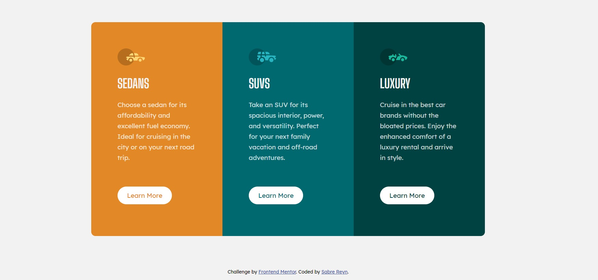

# Frontend Mentor - 3-column preview card component solution

This is a solution to the [3-column preview card component challenge on Frontend Mentor](https://www.frontendmentor.io/challenges/3column-preview-card-component-pH92eAR2-). Frontend Mentor challenges help you improve your coding skills by building realistic projects. 

## Table of contents

- [Overview](#overview)
  - [The challenge](#the-challenge)
  - [Screenshot](#screenshot)
  - [Links](#links)
- [My process](#my-process)
  - [Built with](#built-with)
  - [What I learned](#what-i-learned)
  - [Continued development](#continued-development)
  - [Useful resources](#useful-resources)
- [Author](#author)
- [Acknowledgments](#acknowledgments)

## Overview

## The challenge

The challenge is to build out this 3-column preview card component and get it looking as close to the design as possible.

Users should be able to:

- View the optimal layout depending on their device's screen size
- See hover states for interactive elements

### Screenshot

### Links

- Solution URL: [Code](https://github.com/sabrereyn/3-Column-Card-Preview)
- Live Site URL: [Live Site](https://sabrereyn.github.io/3-Column-Card-Preview/)

## My process

### Built with

- Semantic HTML5 markup
- CSS custom properties
- Flexbox
- Desktop-first workflow

### Continued development

In future projects I'd like to focus more on Flexbox. It's still such a confusing aspect to me that I'd like to get more exposure to the different so I don't always have to check the docs for every little thing.

### Useful resources

- [CSS-tricks](https://css-tricks.com/snippets/css/a-guide-to-flexbox/) - This helped me with implementing and getting the Flexbox to work the way I wanted it to.

## Author

<!-- - Website - [Sabre Reyn](https://www.your-site.com) -->
- Frontend Mentor - [@sabrereyn](https://www.frontendmentor.io/profile/sabrereyn)
- Twitter - [@Sabre_Reyn](https://twitter.com/Sabre_Reyn)
